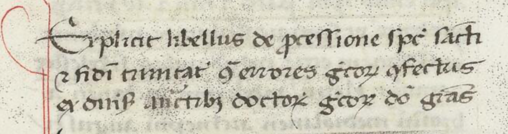

As to its literary genre the *Contra errores graecorum* is a *rescriptum*: a response from Thomas to a conversation begun by someone else. In this case the originator of the conversation was Pope Urban IV, then in Orvieto as was Thomas. It is the work that Pope Urban IV forwarded to Thomas (*exhibitum*) for his study and response that is the origin for the title. A witness to the work that Thomas received can be found in the Vatican Library (Vat. Lat. 808 47ra–65va), and its title leaves no doubt as to the eventual origin of Thomas’s:

A similar labeling at the work’s end:

Explicit libellus de processione spiritus sancti / et fidei trinitatis contra errores grecorum confectus / ex diversis auctoritatibus doctorum grecorum. Deo gratias (Vat. Lat. 808, f. 65va)

This manuscript, Vat. Lat. 808, cannot be the one that Thomas had *prae manibus*, as it is an early 14th-century copy of the compilation generally attributed to Nicholas of Cotrone, one-time bishop elect of Crotone in the modern-day region of Calabria in Southern Italy.[^fn-sample_footnote] The manuscript is rather the one found by Pietro Uccelli in 1869 (Vat. Lat. 808 , ff. 47ra–65va), which helped him crack open the cold case of the then-unknown basis of Thomas’s *Contra errores graecorum*. Uccelli rejoices over his discovery:

>I read the thing through. I find the same fathers that St. Thomas cites. I find them laid out in the same order that the holy doctor read them. I look them over carefully, and I find the same authorities. I list them, check them. I find them all, not a single one excepted. And so I whoop: this is the book that Urban IV handed over to St. Thomas for examination! [^fn-uccelli]

So Uccelli had found the text, though not Thomas's own copy. Who cares? In his day identifying the text was a pearl of great price, since for centuries scholars had been laboring in darkness. Father Hyacinthe Dondaine used Uccelli's Vat. Lat 808 for the reference edition of the *Libellus* provided in the Leonine Edition of Thomas's *Contra errores graecorum* (vol. 40A). To no-one’s surprise he entitled it *Liber de fide trinitatis ex diversis auctoritatibus sanctorum grecorum confectus contra grecos* (pp. A 109–A 151, at A 109).

The case is decided: the title of this work as we have it must remain *Contra errores graecorum*. That is how Thomas's contemporaries and followers knew it, how the earliest catalogues titled it, and how posterity has known it. Perhaps the ironic title will be an invitation to Thomas's students to dismantle the sentiments it produces, and help the Body of Christ breathe with both lungs.

## Bibliography

A. Dondaine, “Nicolas de Cotrone et Les Sources Du Contra errores Graecorum de Saint Thomas.” *Divus Thomas (Freiburg)* 28 (1950): 313–340.

H. DENIFLE; Ae. CHATELAIN (eds.), Chartularium Universitatis Parisiensis, vol. 1: Ab anno MCC usque ad annum MCCLXXXVI (Ex typis fratrum Delalain; Parisiis, 1899; repr.: Culture et Civilisation, Bruxelles, 1964) n. 530, p. 646-647.

H. DENIFLE; Ae. CHATELAIN (eds.), Chartularium Universitatis Parisiensis, vol. 2/1: Ab anno MCCLXXXVI ad annum MCCCL (Ex typis fratrum Delalain, Parisiis, 1891; repr.: Culture et Civilisation, Bruxelles, 1964) n. 642, p. 107-110.

Jordan, Mark D. "The "Greeks" and Thomas Aquinas's Theology," *Journal of Orthodox Christian Studies* 1, no. 2 (2018): 155-166.

Plested, Marcus. *Orthodox Readings of Aquinas*. Oxford, Oxford University Press, 2012. Pp. 9–28.

Principe, W. H. “Thomas Aquinas’s Principles of Interpretation of Patristic Texts.” *Studies in Medieval Culture*. J. R. Sommerfeldt, ed. Kalamazoo, Mich., Medieval Institute, 1976. Pp. 111–121.

UCCELLI, P. A. 1880. *In Isaiam prophetam, In tres psalmos David, In Boethium de hebdomadibus et de trinitate expositiones, accedit anonymi Liber de fide sanctae Trinitatis a S. Thoma examinatus.* Romae, ex Typographia polyglotta S.C. De Propaganda Fidei.

[^fn-sample_footnote]: ‘Cortone’ and ‘Crotone’ refer to the same place (just as ‘Piperno’ and modern-day ‘Priverno’ do). Nicholas of Cotrone came from Durazzo, across the Adriatic (modern-day Durrës in Albania).
[^fn-uccelli]: “Perlego : invenio eosdem Patres quos laudat S. Thomas ; invenio eodem ordine dispositos quo legerat s. Doctor ; attente examino, easdem reperio auctoritates ; illas recenseo et probo ; omnes invenio, ne una quidem excepta. En, exclamo : liber hic est quem s. Thomae Urbanus IV examinanda tradidit,” (Uccelli 1880, p. 365).