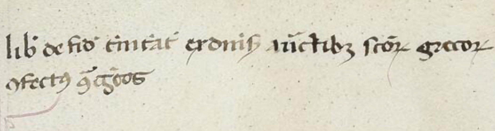

As to its literary genre the *Contra errores graecorum* is a *rescriptum*: a response from Thomas to a conversation begun by someone else. In this case the originator of the conversation was Pope Urban IV, then in Orvieto as was Thomas. It is the work that Pope Urban IV forwarded to Thomas (*exhibitum*) for his study and response that is the origin for the title. A witness to the work that Thomas received can be found in the Vatican Library (Vat. Lat. 808 47ra–65va), and its title leaves no doubt as to the eventual origin of Thomas’s:

<figure>
  
  <figcaption>Liber de fide trinitatis ex diversis auctoritatibus sanctorum grecorum / confectus contra grecos</figcaption>
</figure>

After this point everything should work just fine. The case is decided: the title of this work as we have it must remain *Contra errores graecorum*. That is how Thomas's contemporaries and followers knew it, how the earliest catalogues titled it, and how posterity has known it. Perhaps the ironic title will be an invitation to Thomas's students to dismantle the sentiments it produces, and help the Body of Christ breathe with both lungs.

Over and out.
